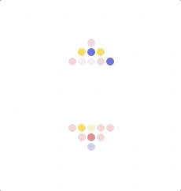
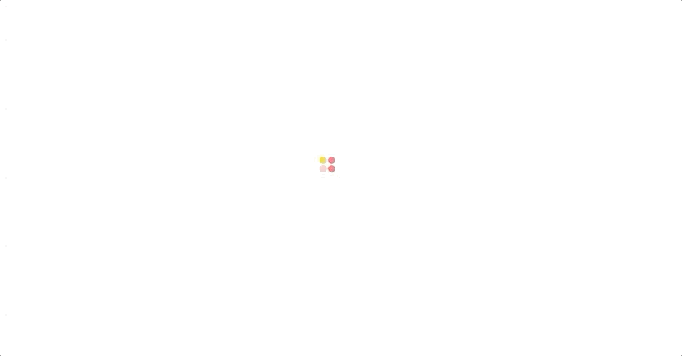
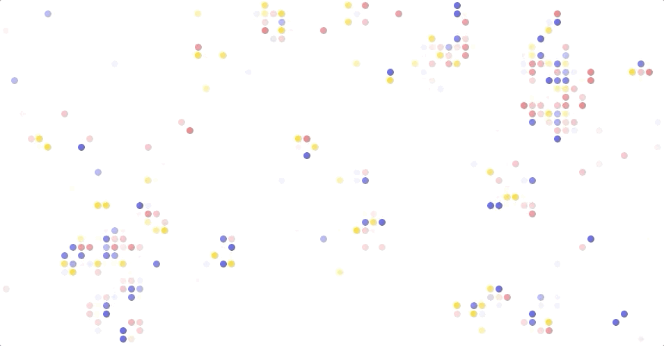
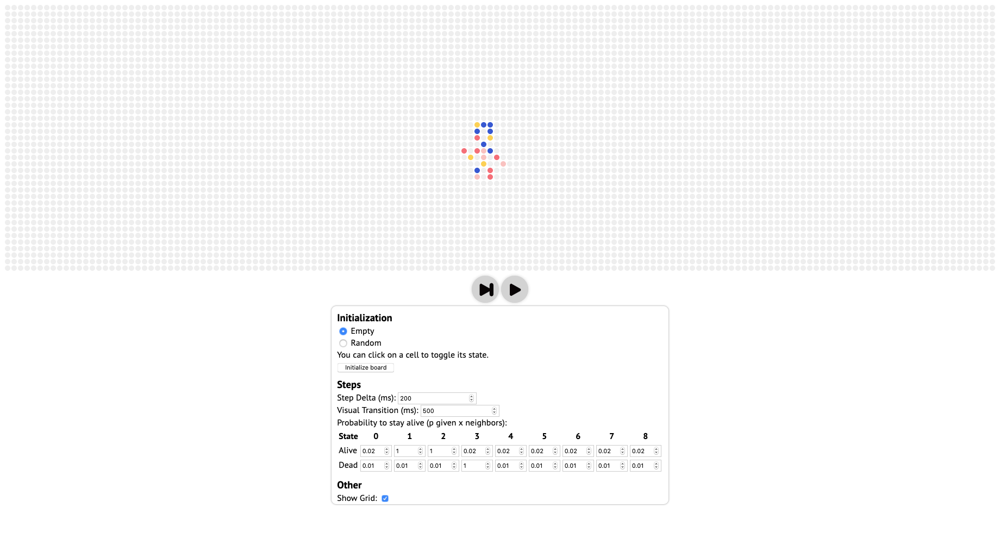

**Note:** If you want to want jump straight into the editor, go [here](https://magmabyte.github.io/game-of-chance/).

## The Game of Life

The Game of Life is a cellular automaton devised by the British mathematician John Horton Conway in 1970. It is a zero-player game, meaning that its evolution is determined by its initial state, requiring no further input. Game of Life is Turing complete, meaning it can do anything your computer can, only arguably much less efficient.

The Game of Life is taught in most introductory Computer Science courses as it is a fun introduction to basic Computer Science concepts. When Conway, it's creator passed away from the complication of COVID-19 in 2020, XKCD dedicated a strip to Conway that illustrates the concept quite well:


## The Rules

The rules are simple. In each round, each cell is checked for whether it should be alive or dead.

1. If it is alive, and it has 2 or 3 alive neighbors, it stays alive. For any other number of neighbors, it dies.
2. If it is dead, and it has 3 alive neighbors, it becomes alive. For any other number of neighbors, it stays dead.

This rule set is simple but it is the source of an incredible amount of patterns:



## Spicing up the Game of Life

When I was looking for a banner for [my website](https://brehm.co), the Game of Life came to my mind. By itself, however, it wouldn't have been the best material for a banner. I thought of a few ways of spicing up the original ruleset and ended up with this:

1. A cell can have 0 to 8 alive neighbors. This cell could stay alive or become alive if it has any other number of neighbors apart from the original 2 or 3. For instance, it could stay alive with 2, 3, or 4 neighbors.
2. Additionally, instead of it being 100% certain, you can assign a probability of becoming alive for each number of neighbors. For instance, a dead cell could become alive with a probability of 80% if it has 2 or 3 neighbors.

Become alive with 1 neighbor:


Become alive and stay alive with 2 neighbors:



This is my final rule set:

| State/Neigbhors                           | 0    | 1    | 2    | 3    | 4    | 5    | 6    | 7    | 8    |
| ----------------------------------------- | ---- | ---- | ---- | ---- | ---- | ---- | ---- | ---- | ---- |
| Alive cell (probability of staying alive) | 0.2  | 1    | 1    | 0.2  | 0.2  | 0.2  | 0.2  | 0.2  | 0.2  |
| Dead cell (probability of becoming alive) | 0.1  | 0.1  | 0.1  | 1    | 0.1  | 0.1  | 0.1  | 0.1  | 0.1  |

It creates patterns similar to this:



## Deployment instructions

This repository has the logic for generating a pattern similar to the one you see on my website, but I added an editor to quickly try out other configurations and settings.



To run the editor on your own machine, `git clone` the repository, `cd` into the repository and then run

```bash
npm install
npm run dev
```

Have fun!